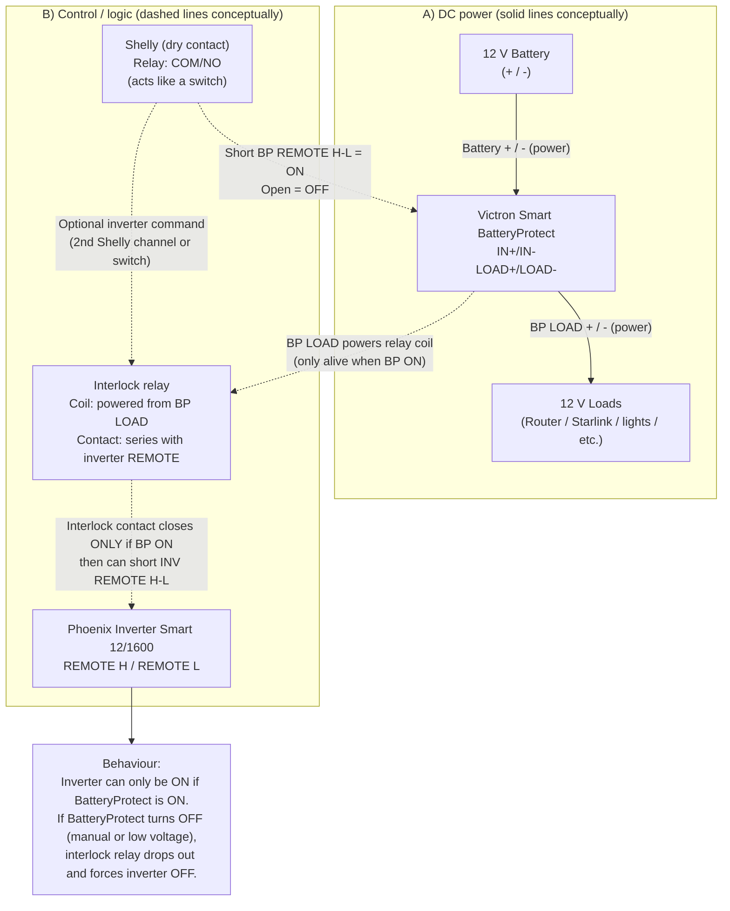

# Hjemmesiden for hytta på Holmevann

> [holmevann.no](https://www.holmevann.no)

Dette repoet inneholder kildekoden og dataene for hjemmesiden jeg har satt opp for hytta vår på Holmevann.
Her er både guider til hvordan man gjør diverse ting, dokumenter til apparater, tips og kanskje prosjektblogger med tiden.

Tanken med å legge det ut er at andre også kan lære av det og lage sin egen variant.

Siden dette har drøyet litt for lenge med å materialisere seg så starter vi bare veldig
enkelt med noen lenker og simple dokumenter. Med tiden blir det kanskje en Markdown-drevet site med offlinestøtte via Service Workers så man kan lese guidene uten dekning, men det er først når jeg får tid (lol).

## Bygge prosjektet

- Installere: `make install`
- Utvikle lokalt med live-reload: `make livereload`
- Liste opp andre muligheter: `make` (eller `make help`)

Se [GitHub Pages](https://help.github.com/articles/setting-up-your-github-pages-site-locally-with-jekyll/) for mer bakgrunnsinfo, f.eks. om du vil sette det opp på eget domene.

## Legge ut ny versjon

Commit endringene dine:

```
git add .
git diff --staged
git commit
```

Så pusher du ut endringene: `make deploy`

## Avhengigheter

- [Bundler](https://bundler.io/) for avhengigheter i Ruby
- [Git LFS](https://git-lfs.com/) for å unngå at repoet vokser for fort


```mermaid
info
```


